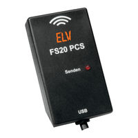

# ELV or Conrad FS20 PCS USB Transmitter for Home Assistant



Control **FS 20 PCS USB Transmitter** directly from Home Assistant. 

[](https://my.home-assistant.io/redirect/hacs_repository/?owner=mtnbin&repository=ha-fs20pcs&category=Integration)


## Features

The fs20pcs integration provides a service called fs20pcs.send. This service allows commands to be sent to any FS20 device using address and command.


## Installation (via HACS)

1.  Click the **Open HACS Repository on MY** button above.
2.  Click **Download** (you might need to "Redownload" if updating).
3.  **Reboot device** (Don't just restart Home Assistant).


## Configuration

1.  Go to **Settings > Devices & Services**.
2.  Click **Add Integration**.
3.  Search for **FS20 PCS Sender**.
4.  If your device is plugged in and accessible, you need to enter your **Housecode**.
5.  Click **Submit**.
6.  Got to your dashboard and add a new Button. Use "Manually". Here is an example:
    ```yaml
    show_name: true
    show_icon: true
    type: button
    name: Light on
    tap_action:
      action: call-service
      service: fs20pcs.send
      data:
        address: "1214"
        command: 16
    icon: mdi:lightbulb-on-outline
    ```
